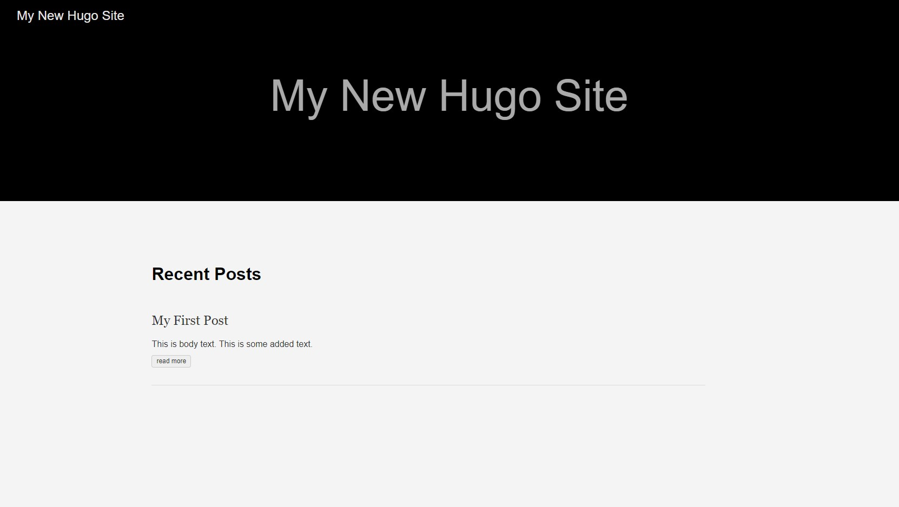
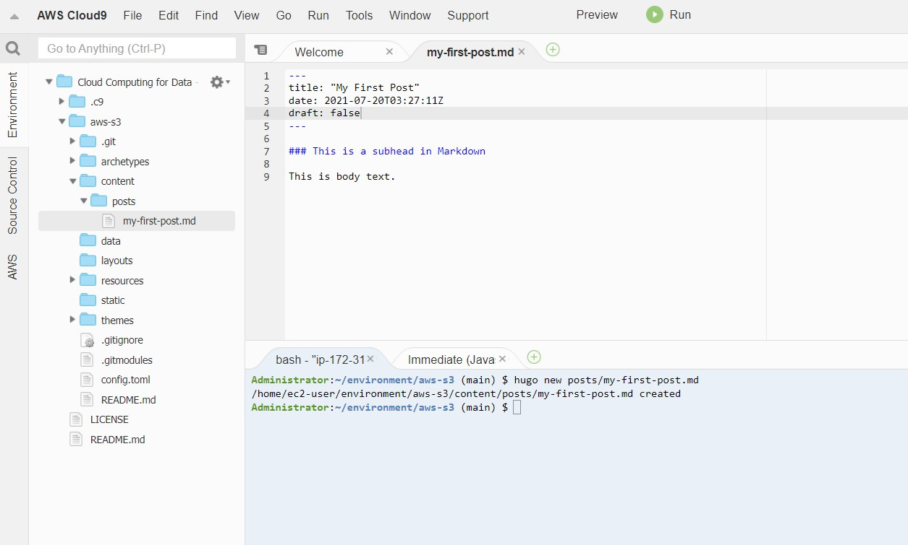

# aws-s3
A continuous delivery pipeline for a Hugo-based website in an S3 bucket.



Steps to create:  

1. In a Cloud9 environment, download and uncompress the latest Hogo "extended" release:

```
wget https://github.com/gohugoio/hugo/releases/download/\
v0.85.0/hugo_extended_0.85.0_Linux-64bit.tar.gz
```
```
tar zxvf hugo_extended_0.85.0_Linux-64bit.tar.gz
```

2. Move hugo file into a bin directory:

```
mkdir -p ~/bin
```
```
mv hugo ~/bin
```
```
which hugo
```

3. Create a GitHub repository, and include a .gitignore file with `public` added.

4. Clone the repo into the same Cloud9 environment, and cd into it:

```
git clone <GitHub repo>
```
```
cd <repo directory>
```

5. Create a local website in hugo: 

```
hugo new site quickstart
```

6. Move quickstart contents to root of repo directory, and then remove quickstart folder:

```
mv quickstart/* .
```
```
rmdir quickstart
```

7. Add a theme:

```
git submodule add https://github.com/budparr/gohugo-theme-ananke.git themes/ananke
```
```
echo 'theme = "ananke"' >> config.toml
```

8. Create a post, which can be edited in Markdown at content/posts/my-first-post:

```
hugo new posts/my-first-post.md
```

   

9. In the Markdown file, toggle "draft" to false to publish post.

10. To run Hugo as a development server, open a TCP port:

    - Go to your EC2 instances, and click on the title that starts with aws-cloud9 and is in a running state 
    - Click on the Security tab, then Security groups link, then Edit inbound rules button, and then Add rule button
    - Set the Port range to `8080` and the Source to `0.0.0.0/0` and then click the Save rules button 
    - Navigate back to the Cloud9 console and run `curl ipinfo.io` to get the testing IP address 
    - Run `hugo serve --bind=0.0.0.0 --port=8080 --baseURL=http://<IP address>/` 

11. To run the website serverless, first create an S3 bucket:
    - Go to your S3 buckets, and create a new bucket
    - Open bucket, go to the Properties tab, click on Edit for Static website hosting, and click on Enable
    - Specify "index.html" and "error.html" as the Index and Error docments, and then hit Save changes
    - Go to the Permissions tab, click Edit for Block public access, uncheck Block all public access, and hit Save
    - Then click Edit for Bucket policy, and add a policy like this (but with your Bucket ARN, shown on top of edit area), and hit Save changes:

        ```
		{
		  "Version":"2012-10-17",
		  "Statement":[
			{
			  "Sid":"PublicRead",
			  "Effect":"Allow",
			  "Principal": "*",
			  "Action":["s3:GetObject","s3:GetObjectVersion"],
			  "Resource":["arn:aws:s3:::DOC-EXAMPLE-BUCKET/*"]
			}
		  ]
		}
        ```
		
12. In the Cloud9 console, run `hugo` to generate html, then copy public file to just created bucket (using bucket name, not the ARN), in correct region:

```
aws s3 sync public/ s3://<bucket-name> --region <for example, us-east-2> --delete
```

13. View the website using the URL in the bucket's Properties > Static website hosting information.

14. To set up continous delivery, create a CodeBuild project:
    - Go to CodeBuild and create a new project in the same region as your S3 bucket
    - In Source, set provider to GitHub, and select Repository in my GitHub account
    - Also in Source, add Repository URL, and optionally add Source version 
    - In Primary source webhook events, select Rebuild every time a code change is pushed to this repository
    - Under Additional configuration, check Use Git submodules so that the theme can be pulled in
    - In Environment, for the Operating system select Amazon Linux 2, and for runtime(s) select Standard
    - Also in Environment, for Image select aws/codebuild/amazonlinux2-x86_64-standard:2.0, and enable flag to build Docker images 
    - Also in Environment, select whether Service role will be a new or existing role, and fill in Role name 
    - Click Create build project
    - Whatever the Service role is, make sure there is an AdministratorAccess policy attached to it under IAM Roles

15. Create buildspec.yml file:

```
touch buildspec.yml 
```

16. Add text to buildspec.yml like [that in this repository](https://github.com/ptdriscoll/aws-s3/blob/main/buildspec.yml), but edit:
    - Under environment_variables, HUGO_VERSION - to match Hugo version you're using 
    - Under post_build, aws s3 sync - to match bucket and region	

17. Add, commit and push files in repo to GitHub:

```
git add *
```
```
git commit -m "Add Hugo files"
```
```
git push
```

### Video tutorials

- [Build Hugo Directory in AWS Cloud9](https://www.coursera.org/lecture/cloud-computing-foundations-duke/build-hugo-directory-in-aws-cloud9-snP2y)
- [Copy Hugo Data into AWS Cloud9 S3 Bucket](https://www.coursera.org/lecture/cloud-computing-foundations-duke/copy-hugo-data-into-aws-cloud9-s3-bucket-MEqyw)
- [Automatic Updating of Hugo in AWS Cloud9](https://www.coursera.org/lecture/cloud-computing-foundations-duke/automatic-updating-of-hugo-in-aws-cloud9-4Wg0W)
- [Hugo continuous deliver with AWS](https://www.youtube.com/watch?v=xiodvLdPnvI)

### More references

- [Continuous Delivery for Hugo Static Site from Zero](https://paiml.com/docs/home/books/cloud-computing-for-data/chapter02-cloud-foundations/#continuous-delivery-for-hugo-static-site-from-zero)
- [GitHub: dukehugofeb1](https://github.com/noahgift/dukehugofeb1)
- [GitHub: hugoforduke17](https://github.com/noahgift/hugoforduke17)
- [GitHub: hugo-continuous-delivery-demo](https://github.com/noahgift/hugo-continuous-delivery-demo)
- [GitHub: Hugo](https://github.com/gohugoio/hugo)
- [Hugo](https://gohugo.io/)
- [Create a build project (console)](https://docs.aws.amazon.com/codebuild/latest/userguide/create-project-console.html)
